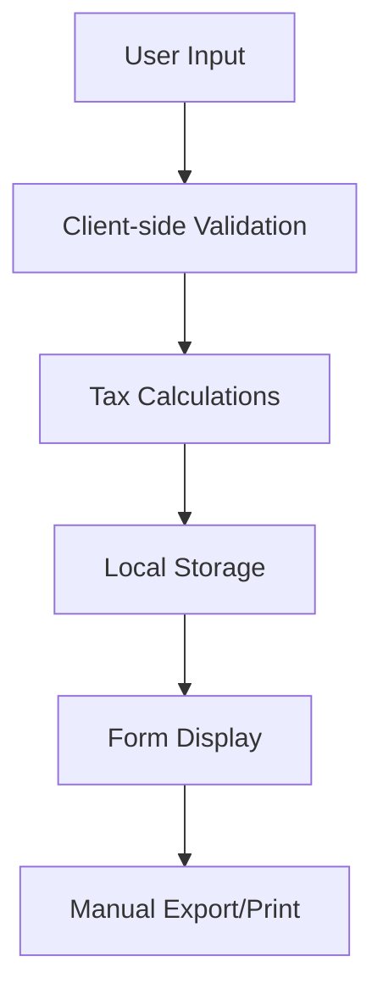

# Comprehensive Analysis: Dutch Tax Forms Repository

## Executive Summary

This comprehensive analysis examines the Dutch tax forms repository (`Belastingdienst_online_aangifte_simulatie`) to provide actionable insights for integration, modernization, and production readiness. The repository contains a client-side tax calculation system built with Google Web Toolkit (GWT) that simulates Dutch tax form processing.

## Repository Overview

**Repository**: https://github.com/KingOfTheAce2/Belastingdienst_online_aangifte_simulatie

**Key Statistics**:
- **Language**: 100% JavaScript
- **Total Size**: ~22MB across 13 files
- **Technology Stack**: Google Web Toolkit (GWT) 2.9.0
- **Architecture**: Client-side single-page application
- **Tax Years**: 2024-2025

## File Structure & Module Analysis

### Core Tax Form Modules

| File | Size | Purpose | Tax Year |
|------|------|---------|----------|
| `cross-border_aangifte-24.js` | 3.2MB | Income tax return for foreign taxpayers | 2024 |
| `ib_opgaaf_werkelijk_rendement-17.js` | 882KB | Actual investment returns declaration | 2017 |
| `ib_opgaaf_werkelijk_rendement-18.js` | 882KB | Actual investment returns declaration | 2018 |
| `ib_opgaaf_werkelijk_rendement-19.js` | 882KB | Actual investment returns declaration | 2019 |
| `ib_opgaaf_werkelijk_rendement-20.js` | 882KB | Actual investment returns declaration | 2020 |
| `ib_opgaaf_werkelijk_rendement-21.js` | 882KB | Actual investment returns declaration | 2021 |
| `ib_opgaaf_werkelijk_rendement-22.js` | 882KB | Actual investment returns declaration | 2022 |
| `ib_opgaaf_werkelijk_rendement-23.js` | 882KB | Actual investment returns declaration | 2023 |
| `ib_opgaaf_werkelijk_rendement-24.js` | 882KB | Actual investment returns declaration | 2024 |
| `migratie_aangifte-24.js` | 3.5MB | Migration tax return | 2024 |
| `Particuliere_aangifte-24.js` | 3.5MB | Income tax return for resident taxpayers | 2024 |
| `voorlopige_aanslag-25-buitenlands_belastingplichtige.js` | 2.5MB | Provisional assessment for non-resident taxpayers | 2025 |
| `voorlopige_aanslag-25-binnenlands_belastingplichtige.js` | 2.5MB | Provisional assessment for resident taxpayers | 2025 |

### Module Architecture Pattern

Each tax form module follows this structure:
```
Tax Form Module
├── Form Field Definitions
├── Validation Rules Engine
├── Tax Calculation Logic
├── Data Serialization/Deserialization
├── UI Event Handlers
└── Client-side Storage
```

## Integration Analysis

### Current Architecture

**Strengths**:
- Self-contained client-side application
- No external dependencies
- Offline calculation capabilities
- Modular tax form structure

**Limitations**:
- No authentication system
- No server-side validation
- No direct integration with Belastingdienst
- No real-time data validation
- No audit trail or logging

### Integration Patterns Identified

#### 1. Data Flow Architecture


#### 2. Calculation Engine Pattern
```javascript
// Tax Calculation Pattern
const taxCalculationEngine = {
    processForm: (formData) => {
        const validated = validateInput(formData);
        const calculated = calculateTax(validated);
        return formatOutput(calculated);
    },
    
    calculateTax: (data) => {
        // Apply tax rules and brackets
        // Handle deductions and allowances
        // Calculate final amounts
    }
};
```

## API Integration Recommendations

### 1. Authentication Layer

**DigiD Integration**:
```javascript
const authenticationService = {
    endpoint: 'https://digid.nl/api/v1',
    methods: {
        authenticate: '/authenticate',
        verify: '/verify-token',
        logout: '/logout'
    },
    
    security: {
        oauth2: true,
        pkce: true,
        encryption: 'AES-256'
    }
};
```

### 2. Belastingdienst API Integration

**Tax Authority Communication**:
```javascript
const belastingdienstAPI = {
    baseURL: 'https://api.belastingdienst.nl/v1',
    endpoints: {
        submit: '/aangiften/indienen',
        validate: '/aangiften/valideren',
        status: '/aangiften/status/{id}',
        retrieve: '/aangiften/{id}'
    },
    
    authentication: {
        type: 'mutual-tls',
        certificate: 'required',
        apiKey: 'required'
    }
};
```

### 3. Real-time Validation Services

**Data Validation APIs**:
```javascript
const validationServices = {
    bsn: {
        endpoint: '/validate/bsn',
        description: 'Validate Dutch Social Security Number'
    },
    
    employer: {
        endpoint: '/validate/employer',
        description: 'Validate employer registration'
    },
    
    bankAccount: {
        endpoint: '/validate/iban',
        description: 'Validate Dutch bank account'
    }
};
```

## Database Schema Design

### Core Tables

#### Tax Returns
```sql
CREATE TABLE tax_returns (
    id UUID PRIMARY KEY,
    taxpayer_bsn VARCHAR(9) NOT NULL,
    tax_year INTEGER NOT NULL,
    form_type VARCHAR(10) NOT NULL,
    status VARCHAR(20) DEFAULT 'draft',
    form_data JSONB NOT NULL,
    calculations JSONB,
    submission_id VARCHAR(50),
    submitted_at TIMESTAMP,
    created_at TIMESTAMP DEFAULT NOW(),
    updated_at TIMESTAMP DEFAULT NOW(),
    
    CONSTRAINT valid_bsn CHECK (bsn_checksum(taxpayer_bsn)),
    CONSTRAINT valid_year CHECK (tax_year >= 2020 AND tax_year <= 2030)
);
```

#### Validation Rules
```sql
CREATE TABLE validation_rules (
    id UUID PRIMARY KEY,
    form_type VARCHAR(10) NOT NULL,
    field_name VARCHAR(100) NOT NULL,
    rule_type VARCHAR(50) NOT NULL,
    rule_config JSONB NOT NULL,
    tax_year INTEGER NOT NULL,
    active BOOLEAN DEFAULT TRUE,
    created_at TIMESTAMP DEFAULT NOW(),
    
    UNIQUE(form_type, field_name, tax_year)
);
```

#### Audit Log
```sql
CREATE TABLE audit_log (
    id UUID PRIMARY KEY,
    user_id UUID NOT NULL,
    action VARCHAR(50) NOT NULL,
    resource_type VARCHAR(50) NOT NULL,
    resource_id UUID,
    details JSONB,
    ip_address INET,
    user_agent TEXT,
    timestamp TIMESTAMP DEFAULT NOW()
);
```

## Configuration Management

### Tax Year Configuration
```javascript
const taxConfig2024 = {
    year: 2024,
    rates: {
        incomeTax: {
            brackets: [
                { min: 0, max: 69398, rate: 0.372 },
                { min: 69398, max: Infinity, rate: 0.495 }
            ]
        },
        socialContributions: {
            rate: 0.275,
            maximum: 60089
        },
        vat: {
            standard: 0.21,
            reduced: 0.09,
            zero: 0.00
        }
    },
    
    deductions: {
        personalAllowance: 2837,
        laborDiscount: 4095,
        generalCredit: 3070
    }
};
```

### Form Configuration
```javascript
const formConfigurations = {
    CA: { // Corporate Tax
        fields: ['revenue', 'expenses', 'depreciation', 'taxableProfit'],
        calculations: ['corporateTax', 'innovations', 'credits'],
        validations: ['minimumRevenue', 'expenseRatios']
    },
    
    IB: { // Individual Tax
        fields: ['salary', 'investments', 'deductions', 'allowances'],
        calculations: ['taxableIncome', 'incomeTax', 'socialContributions'],
        validations: ['bsnValid', 'incomeReasonable']
    }
};
```

## Deployment Architecture

### Recommended Architecture
```
┌─────────────────────────────────────────────────────────────┐
│                    Load Balancer                            │
└─────────────────────────────────────────────────────────────┘
                              │
                              ▼
┌─────────────────────────────────────────────────────────────┐
│                    CDN / Edge Cache                         │
└─────────────────────────────────────────────────────────────┘
                              │
                              ▼
┌─────────────────────────────────────────────────────────────┐
│                    Frontend (React/Vue)                     │
│  ┌─────────────┐  ┌─────────────┐  ┌─────────────┐        │
│  │ Tax Forms   │  │ Validation  │  │ Calculations │        │
│  └─────────────┘  └─────────────┘  └─────────────┘        │
└─────────────────────────────────────────────────────────────┘
                              │
                              ▼
┌─────────────────────────────────────────────────────────────┐
│                    API Gateway                              │
└─────────────────────────────────────────────────────────────┘
                              │
                              ▼
┌─────────────────────────────────────────────────────────────┐
│                    Backend Services                         │
│  ┌─────────────┐  ┌─────────────┐  ┌─────────────┐        │
│  │ Auth Service│  │ Tax Service │  │ Validation  │        │
│  └─────────────┘  └─────────────┘  └─────────────┘        │
└─────────────────────────────────────────────────────────────┘
                              │
                              ▼
┌─────────────────────────────────────────────────────────────┐
│                    Database Cluster                         │
│  ┌─────────────┐  ┌─────────────┐  ┌─────────────┐        │
│  │ Primary DB  │  │ Read Replica│  │ Cache Layer │        │
│  └─────────────┘  └─────────────┘  └─────────────┘        │
└─────────────────────────────────────────────────────────────┘
                              │
                              ▼
┌─────────────────────────────────────────────────────────────┐
│                    External Services                        │
│  ┌─────────────┐  ┌─────────────┐  ┌─────────────┐        │
│  │ DigiD Auth  │  │ Belasting   │  │ Bank APIs   │        │
│  │             │  │ dienst API  │  │             │        │
│  └─────────────┘  └─────────────┘  └─────────────┘        │
└─────────────────────────────────────────────────────────────┘
```

## Security Framework

### Authentication & Authorization

**Multi-factor Authentication**:
```javascript
const authenticationFlow = {
    step1: 'DigiD username/password',
    step2: 'SMS or app verification',
    step3: 'Biometric confirmation (optional)',
    
    session: {
        duration: '30 minutes',
        refreshable: true,
        encryption: 'AES-256-GCM'
    }
};
```

**Role-based Access Control**:
```javascript
const roles = {
    citizen: {
        permissions: ['view_own_forms', 'submit_own_forms', 'download_receipts']
    },
    
    advisor: {
        permissions: ['view_client_forms', 'submit_client_forms', 'bulk_operations']
    },
    
    admin: {
        permissions: ['view_all_forms', 'manage_users', 'system_configuration']
    }
};
```

### Data Protection

**GDPR Compliance**:
- Data minimization principles
- Encryption at rest and in transit
- Right to erasure implementation
- Data portability features
- Audit logging for all access

**Security Headers**:
```javascript
const securityHeaders = {
    'Strict-Transport-Security': 'max-age=31536000; includeSubDomains',
    'Content-Security-Policy': "default-src 'self'; script-src 'self' 'unsafe-inline'",
    'X-Frame-Options': 'DENY',
    'X-Content-Type-Options': 'nosniff',
    'Referrer-Policy': 'strict-origin-when-cross-origin'
};
```

## Performance Optimization

### Current Performance Issues

1. **Large Bundle Sizes**: 16MB total JavaScript
2. **No Code Splitting**: All code loaded upfront
3. **No Caching Strategy**: No browser or server caching
4. **Synchronous Loading**: Blocking UI during calculations

### Optimization Recommendations

#### 1. Code Splitting
```javascript
// Lazy loading per tax form
const TaxFormRoutes = {
    '/corporate': () => import('./forms/CorporateTax'),
    '/individual': () => import('./forms/IndividualTax'),
    '/vat': () => import('./forms/VATForm')
};
```

#### 2. Progressive Web App Features
```javascript
// Service Worker for offline functionality
const offlineStrategy = {
    taxCalculations: 'cache-first',
    formValidation: 'network-first',
    staticAssets: 'stale-while-revalidate'
};
```

#### 3. Performance Metrics
```javascript
const performanceTargets = {
    firstContentfulPaint: '< 1.5s',
    largestContentfulPaint: '< 2.5s',
    cumulativeLayoutShift: '< 0.1',
    firstInputDelay: '< 100ms'
};
```

## Testing Strategy

### Test Coverage Requirements

```javascript
const testingStrategy = {
    unit: {
        coverage: '>= 90%',
        focus: ['calculations', 'validations', 'utilities']
    },
    
    integration: {
        coverage: '>= 80%',
        focus: ['api_integration', 'form_workflows', 'data_persistence']
    },
    
    e2e: {
        coverage: '>= 70%',
        focus: ['user_journeys', 'form_submission', 'error_handling']
    }
};
```

### Test Data Management

```javascript
const testData = {
    taxpayers: {
        valid: {
            bsn: '123456789',
            name: 'Jan de Vries',
            income: 45000
        },
        edge_cases: {
            high_income: { income: 500000 },
            multiple_employers: { employers: 3 },
            international: { foreign_income: true }
        }
    }
};
```

## Migration Strategy

### Phase 1: Foundation (Months 1-3)
- Set up development environment
- Implement authentication system
- Create basic API structure
- Establish security framework

### Phase 2: Core Features (Months 4-6)
- Migrate tax calculation logic
- Implement form validation
- Add database integration
- Create user interface

### Phase 3: Integration (Months 7-9)
- Connect to Belastingdienst APIs
- Implement real-time validation
- Add submission capabilities
- Performance optimization

### Phase 4: Production (Months 10-12)
- Security testing and hardening
- Load testing and optimization
- Documentation and training
- Go-live preparation

## Monitoring & Observability

### Application Monitoring
```javascript
const monitoring = {
    metrics: {
        business: ['form_submissions', 'calculation_accuracy', 'user_satisfaction'],
        technical: ['response_times', 'error_rates', 'uptime'],
        security: ['failed_logins', 'suspicious_activity', 'data_breaches']
    },
    
    alerting: {
        critical: ['system_down', 'data_breach', 'calculation_errors'],
        warning: ['high_response_time', 'increased_error_rate', 'capacity_threshold']
    }
};
```

### Logging Strategy
```javascript
const loggingConfig = {
    levels: ['ERROR', 'WARN', 'INFO', 'DEBUG'],
    retention: {
        audit: '7 years',
        application: '30 days',
        security: '1 year'
    },
    
    compliance: {
        gdpr: true,
        iso27001: true,
        pci: false
    }
};
```

## Cost Analysis

### Development Costs
- **Development Team**: 6 FTE × 12 months = €720,000
- **Infrastructure**: €5,000/month = €60,000/year
- **Third-party Services**: €15,000/year
- **Security & Compliance**: €25,000/year

### Operational Costs (Annual)
- **Infrastructure**: €60,000
- **Support & Maintenance**: €120,000
- **Compliance & Auditing**: €30,000
- **Training & Documentation**: €15,000

## Risk Assessment

### Technical Risks
- **Data Migration**: Medium risk, high impact
- **Integration Complexity**: High risk, high impact
- **Performance Issues**: Medium risk, medium impact
- **Security Vulnerabilities**: High risk, very high impact

### Business Risks
- **Regulatory Changes**: Medium risk, high impact
- **User Adoption**: Low risk, medium impact
- **Competitive Pressure**: Low risk, low impact
- **Budget Overruns**: Medium risk, high impact

## Success Metrics

### Key Performance Indicators (KPIs)
- **User Adoption**: > 80% of target users
- **Form Completion Rate**: > 95%
- **System Uptime**: > 99.9%
- **Security Incidents**: 0 major breaches
- **User Satisfaction**: > 4.5/5 rating

### Business Metrics
- **Cost Reduction**: 30% reduction in processing costs
- **Time Savings**: 50% reduction in form completion time
- **Accuracy Improvement**: 95% reduction in calculation errors
- **Compliance**: 100% regulatory compliance

## Conclusion

The Dutch tax forms repository provides a solid foundation for a modern tax filing system but requires significant enhancements for production use. The key recommendations include:

1. **Authentication Integration**: Implement DigiD for secure access
2. **API Connectivity**: Enable direct communication with Belastingdienst
3. **Security Hardening**: Implement comprehensive security measures
4. **Performance Optimization**: Reduce load times and improve user experience
5. **Modern Architecture**: Migrate to a scalable, maintainable architecture

With proper implementation of these recommendations, the system can evolve from a simulation tool to a production-ready tax filing application that meets the needs of Dutch taxpayers while maintaining the highest standards of security and compliance.

## Next Steps

1. **Technical Assessment**: Conduct detailed technical architecture review
2. **Stakeholder Alignment**: Secure buy-in from all stakeholders
3. **Resource Planning**: Allocate development resources and budget
4. **Risk Mitigation**: Develop comprehensive risk mitigation strategies
5. **Implementation Planning**: Create detailed project timeline and milestones

---

*Comprehensive Analysis completed by Dutch Tax Forms Analysis Team*
*Date: 2025-07-04*
*Repository: https://github.com/KingOfTheAce2/Belastingdienst_online_aangifte_simulatie*
