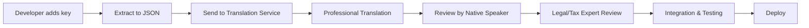

# Internationalization Strategy for Dutch Tax Forms Application

## Executive Summary

This document outlines a comprehensive internationalization (i18n) strategy for the Dutch tax forms application, enabling seamless support for multiple languages with a focus on Dutch and English as primary languages, and extending to other major EU languages.

## 1. Language Support Strategy

### 1.1 Primary Languages
- **Dutch (nl-NL)**: Default language for the application
- **English (en-GB)**: Primary alternative for international users

### 1.2 Secondary EU Languages
- **German (de-DE)**: High priority due to proximity and business relations
- **French (fr-FR)**: EU official language
- **Spanish (es-ES)**: Growing expat community
- **Italian (it-IT)**: Significant business presence
- **Polish (pl-PL)**: Significant exapt community

### 1.3 Non EU Languages
These cover key expat and migrant groups living in the Netherlands:
- **Russian (ru-RU)**
- **Ukrainian (uk-UA)**
- **Turkish (tr-TR)**
- **Arabic (ar)**
- **Hindi (hi-IN)**
- 
### 1.4 Language Detection
```javascript
// Browser language detection hierarchy
1. User preference (stored in localStorage)
2. URL parameter (?lang=nl)
3. Browser language settings
4. Geolocation-based suggestion
5. Default to Dutch (nl-NL)
```

### 1.5 Fallback Mechanisms
```javascript
// Language fallback chain
nl-NL → nl → en-GB → en → default keys
de-DE → de → en-GB → en → default keys
fr-FR → fr → en-GB → en → default keys
```

## 2. Translation Framework

### 2.1 Technology Stack
**Primary Choice: react-i18next**
- Mature ecosystem with React integration
- Lazy loading support
- Pluralization and interpolation
- TypeScript support
- React Suspense integration

### 2.2 Translation Key Structure
```typescript
// Hierarchical key structure
{
  "forms": {
    "income": {
      "title": "Inkomstenbelasting",
      "fields": {
        "salary": {
          "label": "Salaris",
          "placeholder": "Voer uw bruto jaarsalaris in",
          "help": "Dit is uw salaris voor aftrek van belastingen"
        }
      }
    }
  },
  "validation": {
    "required": "Dit veld is verplicht",
    "invalidBSN": "Ongeldig BSN-nummer"
  }
}
```

### 2.3 Namespace Organization
```
/locales
  /nl-NL
    - common.json      // Shared UI elements
    - forms.json       // Form-specific translations
    - validation.json  // Error messages
    - legal.json       // Legal text
    - help.json        // Help content
  /en-GB
    - common.json
    - forms.json
    - validation.json
    - legal.json
    - help.json
```

### 2.4 Dynamic Loading Strategy
```javascript
// Load translations on demand
i18next.use(ChunkLoadingPlugin).init({
  backend: {
    loadPath: '/locales/{{lng}}/{{ns}}.json',
    allowMultiLoading: true,
    queryStringParams: { v: '1.0.0' }
  },
  ns: ['common'], // Initially load only common namespace
  defaultNS: 'common',
  fallbackLng: 'en-GB'
});
```

## 3. Content Translation Plan

### 3.1 Form Labels and Placeholders
```json
// Dutch to English mapping examples
{
  "bsn": "BSN → Citizen Service Number",
  "voorlopige_aanslag": "Provisional Assessment",
  "loonheffing": "Payroll Tax",
  "inkomstenbelasting": "Income Tax",
  "btw": "BTW → VAT",
  "eigen_woning": "Owner-occupied Home"
}
```

### 3.2 Error Messages and Validation
```typescript
// Multilingual validation messages
const validationMessages = {
  "nl-NL": {
    "bsn.invalid": "Het ingevoerde BSN is ongeldig",
    "bsn.checksum": "BSN voldoet niet aan de 11-proef",
    "income.negative": "Inkomen kan niet negatief zijn",
    "date.future": "Datum kan niet in de toekomst liggen"
  },
  "en-GB": {
    "bsn.invalid": "The entered BSN is invalid",
    "bsn.checksum": "BSN does not pass the 11-check",
    "income.negative": "Income cannot be negative",
    "date.future": "Date cannot be in the future"
  }
};
```

### 3.3 Help Text and Explanations
```json
{
  "help": {
    "box1": {
      "nl-NL": "Box 1 bevat het inkomen uit werk en woning. Dit includeert uw salaris, uitkeringen, en het eigenwoningforfait.",
      "en-GB": "Box 1 contains income from work and primary residence. This includes your salary, benefits, and imputed rental value of your home."
    }
  }
}
```

### 3.4 Legal Disclaimers
```typescript
// Legal text with version control
const legalText = {
  "privacyNotice": {
    "nl-NL": {
      "version": "2024.1",
      "text": "Uw gegevens worden verwerkt conform de AVG...",
      "lastUpdated": "2024-01-01"
    },
    "en-GB": {
      "version": "2024.1",
      "text": "Your data is processed in accordance with GDPR...",
      "lastUpdated": "2024-01-01"
    }
  }
};
```

### 3.5 Modal and Tooltip Content
```jsx
// Contextual help with translations
<Tooltip
  content={t('tooltips.bsn_format', 
    'BSN moet 9 cijfers bevatten | BSN must contain 9 digits'
  )}
/>
```

## 4. UX Considerations

### 4.1 Language Switcher Design
```jsx
// Accessible language switcher component
<LanguageSwitcher
  position="header-right"
  display="flag-and-name"
  showNativeName={true}
  groupByRegion={true}
/>
```

### 4.2 RTL Language Support
```css
/* RTL-ready styles */
.form-field {
  margin-inline-start: 1rem;
  text-align: start;
}

[dir="rtl"] .form-field {
  /* Automatic RTL adjustments */
}
```

### 4.3 Cultural Adaptations
```typescript
// Locale-specific formatting
const formatters = {
  currency: new Intl.NumberFormat(locale, {
    style: 'currency',
    currency: 'EUR',
    minimumFractionDigits: 2
  }),
  date: new Intl.DateTimeFormat(locale, {
    day: '2-digit',
    month: '2-digit',
    year: 'numeric'
  }),
  percentage: new Intl.NumberFormat(locale, {
    style: 'percent',
    minimumFractionDigits: 2
  })
};
```

### 4.4 Number and Date Formatting
```javascript
// Dutch vs English formatting
nl-NL: € 1.234,56  | 31-12-2024 | 42,5%
en-GB: €1,234.56   | 31/12/2024 | 42.5%
```

## 5. Translation Management

### 5.1 Translation Workflow


### 5.2 Professional Translation Services
- **Primary Partner**: Specialized financial/legal translation service
- **Requirements**:
  - Native speakers with tax law expertise
  - ISO 17100:2015 certification
  - Confidentiality agreements
  - Version control integration

### 5.3 Community Contributions
```typescript
// Crowdsourcing platform integration
interface TranslationContribution {
  key: string;
  language: string;
  suggestedTranslation: string;
  contributor: string;
  votes: number;
  status: 'pending' | 'approved' | 'rejected';
}
```

### 5.4 Quality Assurance
- **Automated checks**:
  - Missing translations detection
  - Placeholder consistency
  - Character length validation
  - Special character encoding

- **Manual review process**:
  - Native speaker review
  - Context verification
  - Legal accuracy check
  - User testing with target audience

## 6. Technical Implementation

### 6.1 Translation File Structure
```
/src
  /locales
    /nl-NL
      - index.ts         // Namespace exports
      - common.json
      - forms.json
      - validation.json
    /en-GB
      - index.ts
      - common.json
      - forms.json
      - validation.json
  /i18n
    - config.ts         // i18next configuration
    - hooks.ts          // Custom React hooks
    - utils.ts          // Helper functions
    - types.ts          // TypeScript definitions
```

### 6.2 Build-time Optimization
```javascript
// Webpack configuration for translation optimization
module.exports = {
  plugins: [
    new I18nPlugin({
      // Extract only used translations
      removeUnusedKeys: true,
      // Generate translation reports
      report: true,
      // Create separate bundles per language
      splitChunks: true
    })
  ]
};
```

### 6.3 Runtime Language Switching
```typescript
// Seamless language switching without page reload
const changeLanguage = async (newLang: string) => {
  // Load new language resources
  await i18n.loadLanguages(newLang);
  
  // Update language
  await i18n.changeLanguage(newLang);
  
  // Persist preference
  localStorage.setItem('preferredLanguage', newLang);
  
  // Update document attributes
  document.documentElement.lang = newLang;
  document.documentElement.dir = isRTL(newLang) ? 'rtl' : 'ltr';
};
```

### 6.4 SEO Considerations
```html
<!-- Language-specific meta tags -->
<link rel="alternate" hreflang="nl" href="https://app.nl/nl/" />
<link rel="alternate" hreflang="en" href="https://app.nl/en/" />
<link rel="alternate" hreflang="x-default" href="https://app.nl/" />

<!-- Open Graph localization -->
<meta property="og:locale" content="nl_NL" />
<meta property="og:locale:alternate" content="en_GB" />
```

## 7. Dutch Tax Terminology Translation Guide

### 7.1 Common Tax Terms
| Dutch | English | Context |
|-------|---------|---------|
| Aangifte | Tax Return | General tax filing |
| Aftrekpost | Deduction | Tax-deductible item |
| Belastbaar inkomen | Taxable Income | Income subject to tax |
| Belastingvrije voet | Tax-free Allowance | Personal allowance |
| Bijtellingen | Additions | Added benefits |
| Eigenwoningforfait | Imputed Rental Value | Notional rental income |
| Heffingskorting | Tax Credit | Direct tax reduction |
| Hypotheekrenteaftrek | Mortgage Interest Deduction | Home loan interest |
| Loonheffing | Payroll Tax | Employer-withheld tax |
| Voorlopige aanslag | Provisional Assessment | Advance tax payment |
| Voorlopige teruggave | Provisional Refund | Advance tax refund |

### 7.2 Form-Specific Translations
```json
{
  "forms": {
    "M": {
      "nl": "M-biljet (Aangifte inkomstenbelasting)",
      "en": "M-form (Income Tax Return)"
    },
    "IB": {
      "nl": "IB - Inkomstenbelasting",
      "en": "IB - Income Tax"
    },
    "VA": {
      "nl": "VA - Voorlopige aanslag",
      "en": "VA - Provisional Tax Assessment"
    }
  }
}
```

## 8. Implementation Roadmap

### Phase 1: Foundation (Weeks 1-2)
- Set up react-i18next framework
- Create translation file structure
- Implement language detection and switching
- Extract all hardcoded strings

### Phase 2: Primary Languages (Weeks 3-4)
- Complete Dutch translations
- Professional English translation
- Implement formatting utilities
- Create translation components

### Phase 3: Extended Support (Weeks 5-6)
- Add German and French support
- Implement lazy loading
- Optimize bundle sizes
- Set up translation management

### Phase 4: Quality Assurance (Weeks 7-8)
- User testing with native speakers
- Legal review of translations
- Performance optimization
- Documentation completion

## 9. Maintenance and Updates

### 9.1 Version Control
```json
{
  "translations": {
    "version": "1.0.0",
    "lastUpdated": "2024-01-01",
    "languages": {
      "nl-NL": { "complete": true, "reviewed": "2024-01-01" },
      "en-GB": { "complete": true, "reviewed": "2024-01-01" },
      "de-DE": { "complete": false, "progress": 65 }
    }
  }
}
```

### 9.2 Update Process
1. Annual review for tax law changes
2. Quarterly community feedback integration
3. Monthly bug fixes and improvements
4. Continuous monitoring of translation quality

## 10. Success Metrics

### 10.1 Translation Coverage
- 100% coverage for primary languages
- 95%+ coverage for secondary languages
- <24h turnaround for critical updates

### 10.2 User Satisfaction
- Language preference analytics
- User feedback on translation quality
- Support ticket analysis by language
- Completion rates by language

### 10.3 Performance Metrics
- Translation loading time <100ms
- Language switch time <200ms
- Bundle size increase <15% per language
- Memory usage optimization

## Conclusion

This internationalization strategy provides a robust framework for supporting multiple languages in the Dutch tax forms application. By focusing on quality translations, optimal user experience, and maintainable architecture, we ensure that users across different languages can effectively use the application while maintaining accuracy in the critical domain of tax filing.
