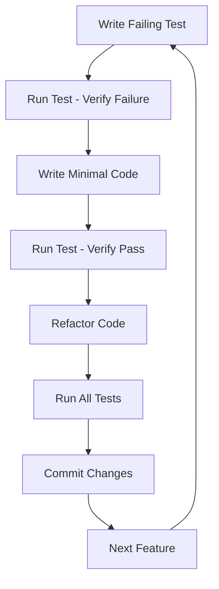

# TDD Implementation Plan for Dutch Tax System
## 5-Agent Swarm Coordination Strategy

### 🎯 Project Overview
This document outlines a comprehensive Test-Driven Development (TDD) implementation strategy for the Dutch Tax System integration with Belastingdienst API, utilizing a 5-agent swarm coordination approach.

### 📋 Executive Summary
- **Project**: Dutch Tax System with Belastingdienst API Integration
- **Methodology**: Test-Driven Development (TDD)
- **Architecture**: 5-Agent Swarm Coordination
- **Testing Framework**: Vitest, React Testing Library, Playwright, MSW
- **Implementation Timeline**: 6 phases over 12 weeks

---

## 1. 5-Agent Swarm Structure

### 🏗️ Agent 1: Frontend Component Developer
**Role**: UI Component Implementation and Testing
**Responsibilities**:
- Develop React components following TDD principles
- Write component unit tests with React Testing Library
- Implement responsive design for Dutch tax forms
- Create reusable form components and validation logic
- Ensure accessibility compliance (WCAG 2.1 AA)

**Key Technologies**:
- React 18+ with TypeScript
- React Testing Library
- Vitest for unit testing
- Tailwind CSS for styling
- React Hook Form for form management

**Testing Focus**:
- Component rendering tests
- User interaction testing
- Form validation testing
- Accessibility testing
- Visual regression testing

### 🔌 Agent 2: API Integration Specialist
**Role**: Belastingdienst API Integration and Contract Testing
**Responsibilities**:
- Design and implement API client for Belastingdienst
- Create API contract tests and mocking strategies
- Implement authentication and authorization flows
- Handle error scenarios and retry logic
- Ensure data security and privacy compliance

**Key Technologies**:
- Axios for HTTP client
- MSW (Mock Service Worker) for API mocking
- Zod for schema validation
- JWT for authentication
- OpenAPI/Swagger for API documentation

**Testing Focus**:
- API contract testing
- Authentication flow testing
- Error handling scenarios
- Data validation testing
- Security testing

### 🧪 Agent 3: Test Automation Engineer
**Role**: Test Infrastructure and Automation
**Responsibilities**:
- Set up testing frameworks and CI/CD pipelines
- Implement E2E testing with Playwright
- Create test data management strategies
- Establish code coverage requirements
- Implement performance testing

**Key Technologies**:
- Playwright for E2E testing
- Vitest for unit and integration testing
- GitHub Actions for CI/CD
- Docker for test environment consistency
- Lighthouse for performance testing

**Testing Focus**:
- E2E workflow testing
- Cross-browser compatibility
- Performance testing
- Load testing
- Test automation pipelines

### 🎨 Agent 4: UI/UX Implementation Lead
**Role**: User Experience and Interface Design Implementation
**Responsibilities**:
- Implement multi-language support (Dutch, English)
- Design and test user workflows
- Create responsive layouts for tax forms
- Implement accessibility features
- Ensure consistent design system

**Key Technologies**:
- React i18next for internationalization
- Tailwind CSS for responsive design
- Headless UI for accessible components
- Framer Motion for animations
- Storybook for component documentation

**Testing Focus**:
- User journey testing
- Accessibility testing
- Multi-language testing
- Responsive design testing
- Usability testing

### 🔍 Agent 5: Quality Assurance Coordinator
**Role**: Quality Oversight and Process Management
**Responsibilities**:
- Coordinate testing activities across agents
- Establish quality gates and metrics
- Monitor test coverage and code quality
- Implement continuous integration workflows
- Manage test environments and data

**Key Technologies**:
- SonarQube for code quality
- Jest/Vitest for coverage reports
- GitHub Actions for automation
- Docker for environment management
- Datadog for monitoring

**Testing Focus**:
- Test coverage analysis
- Quality metrics tracking
- Integration testing coordination
- Release quality validation
- Performance monitoring

---

## 2. TDD Implementation Strategy

### 🔴 Red-Green-Refactor Cycle

#### Red Phase (Write Failing Tests)
1. **Test First**: Write tests before implementation
2. **Specific Requirements**: Tests define exact behavior
3. **Failure Confirmation**: Ensure tests fail for right reasons
4. **Documentation**: Tests serve as living documentation

#### Green Phase (Make Tests Pass)
1. **Minimal Implementation**: Write simplest code to pass tests
2. **Focus on Functionality**: Avoid premature optimization
3. **Clear Intent**: Code should clearly express intent
4. **Rapid Feedback**: Quick iterations to maintain flow

#### Refactor Phase (Improve Code Quality)
1. **Maintain Behavior**: Tests ensure behavior preservation
2. **Improve Design**: Enhance code structure and readability
3. **Performance Optimization**: Optimize when needed
4. **Code Quality**: Follow established patterns and conventions

### 🧪 Testing Framework Configuration

#### Vitest Configuration
```typescript
// vitest.config.ts
import { defineConfig } from 'vitest/config'
import react from '@vitejs/plugin-react'

export default defineConfig({
  plugins: [react()],
  test: {
    environment: 'jsdom',
    setupFiles: ['./src/test/setup.ts'],
    coverage: {
      provider: 'v8',
      reporter: ['text', 'json', 'html'],
      exclude: [
        'node_modules/',
        'src/test/',
        '**/*.d.ts',
        '**/*.config.*',
        'dist/'
      ],
      thresholds: {
        global: {
          branches: 80,
          functions: 80,
          lines: 80,
          statements: 80
        }
      }
    }
  }
})
```

#### React Testing Library Setup
```typescript
// src/test/setup.ts
import { expect, afterEach, vi } from 'vitest'
import { cleanup } from '@testing-library/react'
import * as matchers from '@testing-library/jest-dom/matchers'

expect.extend(matchers)

afterEach(() => {
  cleanup()
})

// Mock window.matchMedia
Object.defineProperty(window, 'matchMedia', {
  writable: true,
  value: vi.fn().mockImplementation(query => ({
    matches: false,
    media: query,
    onchange: null,
    addListener: vi.fn(),
    removeListener: vi.fn(),
    addEventListener: vi.fn(),
    removeEventListener: vi.fn(),
    dispatchEvent: vi.fn(),
  })),
})
```

#### Playwright Configuration
```typescript
// playwright.config.ts
import { defineConfig, devices } from '@playwright/test'

export default defineConfig({
  testDir: './tests/e2e',
  fullyParallel: true,
  forbidOnly: !!process.env.CI,
  retries: process.env.CI ? 2 : 0,
  workers: process.env.CI ? 1 : undefined,
  reporter: [
    ['html'],
    ['junit', { outputFile: 'test-results/junit.xml' }]
  ],
  use: {
    baseURL: 'http://localhost:3000',
    trace: 'on-first-retry',
    screenshot: 'only-on-failure',
  },
  projects: [
    {
      name: 'chromium',
      use: { ...devices['Desktop Chrome'] },
    },
    {
      name: 'firefox',
      use: { ...devices['Desktop Firefox'] },
    },
    {
      name: 'webkit',
      use: { ...devices['Desktop Safari'] },
    },
  ],
  webServer: {
    command: 'npm run dev',
    url: 'http://localhost:3000',
    reuseExistingServer: !process.env.CI,
  },
})
```

---

## 3. Testing Hierarchy

### 🧪 Unit Tests (70% of tests)
**Scope**: Individual functions, hooks, and utilities
**Framework**: Vitest
**Coverage Target**: 90%

#### Test Categories:
1. **Utility Functions**
   - Tax calculation functions
   - Date formatting utilities
   - Validation helpers
   - Currency conversion

2. **Custom Hooks**
   - `useAuth` authentication hook
   - `useForm` form management
   - `useApi` API interaction
   - `useLocalStorage` data persistence

3. **Business Logic**
   - Tax form validation rules
   - Income calculation logic
   - Deduction calculations
   - Tax bracket computations

#### Example Unit Test:
```typescript
// src/utils/taxCalculation.test.ts
import { describe, it, expect } from 'vitest'
import { calculateIncomeTax } from './taxCalculation'

describe('calculateIncomeTax', () => {
  it('should calculate correct tax for income under €69,398', () => {
    const income = 50000
    const expectedTax = 18525 // 37.07% rate
    
    expect(calculateIncomeTax(income)).toBe(expectedTax)
  })
  
  it('should handle edge case at tax bracket boundary', () => {
    const income = 69398
    const expectedTax = 25717
    
    expect(calculateIncomeTax(income)).toBe(expectedTax)
  })
  
  it('should throw error for negative income', () => {
    expect(() => calculateIncomeTax(-1000)).toThrow('Income cannot be negative')
  })
})
```

### 🧩 Component Tests (20% of tests)
**Scope**: React components and their interactions
**Framework**: React Testing Library + Vitest
**Coverage Target**: 85%

#### Test Categories:
1. **Form Components**
   - Income input forms
   - Tax deduction forms
   - Personal information forms
   - File upload components

2. **Display Components**
   - Tax calculation summaries
   - Progress indicators
   - Error messages
   - Success confirmations

3. **Interactive Components**
   - Navigation components
   - Modal dialogs
   - Dropdown menus
   - Language switcher

#### Example Component Test:
```typescript
// src/components/IncomeForm.test.tsx
import { render, screen, fireEvent, waitFor } from '@testing-library/react'
import { describe, it, expect, vi } from 'vitest'
import { IncomeForm } from './IncomeForm'

describe('IncomeForm', () => {
  it('should validate required income field', async () => {
    const onSubmit = vi.fn()
    render(<IncomeForm onSubmit={onSubmit} />)
    
    const submitButton = screen.getByRole('button', { name: /submit/i })
    fireEvent.click(submitButton)
    
    await waitFor(() => {
      expect(screen.getByText('Income is required')).toBeInTheDocument()
    })
    
    expect(onSubmit).not.toHaveBeenCalled()
  })
  
  it('should format currency input correctly', async () => {
    render(<IncomeForm onSubmit={vi.fn()} />)
    
    const incomeInput = screen.getByLabelText(/annual income/i)
    fireEvent.change(incomeInput, { target: { value: '50000' } })
    
    await waitFor(() => {
      expect(incomeInput).toHaveValue('€50,000')
    })
  })
})
```

### 🔗 Integration Tests (8% of tests)
**Scope**: Component interactions and data flow
**Framework**: React Testing Library + MSW
**Coverage Target**: 80%

#### Test Categories:
1. **Form Workflows**
   - Complete tax form submission
   - Multi-step form navigation
   - Data persistence between steps
   - Error handling across forms

2. **API Integration**
   - Authentication flow
   - Data submission to Belastingdienst
   - Error response handling
   - Loading states

#### Example Integration Test:
```typescript
// src/integration/TaxFormSubmission.test.tsx
import { render, screen, fireEvent, waitFor } from '@testing-library/react'
import { describe, it, expect, beforeEach } from 'vitest'
import { rest } from 'msw'
import { server } from '../mocks/server'
import { TaxFormWizard } from '../components/TaxFormWizard'

describe('Tax Form Submission Integration', () => {
  beforeEach(() => {
    server.use(
      rest.post('/api/belastingdienst/submit', (req, res, ctx) => {
        return res(ctx.json({ success: true, referenceNumber: 'TX123456' }))
      })
    )
  })
  
  it('should complete full tax form submission workflow', async () => {
    render(<TaxFormWizard />)
    
    // Step 1: Personal Information
    fireEvent.change(screen.getByLabelText(/bsn/i), { 
      target: { value: '123456789' } 
    })
    fireEvent.click(screen.getByRole('button', { name: /next/i }))
    
    // Step 2: Income Information
    await waitFor(() => {
      expect(screen.getByText('Income Information')).toBeInTheDocument()
    })
    
    fireEvent.change(screen.getByLabelText(/annual income/i), { 
      target: { value: '50000' } 
    })
    fireEvent.click(screen.getByRole('button', { name: /next/i }))
    
    // Step 3: Submit
    await waitFor(() => {
      expect(screen.getByText('Review and Submit')).toBeInTheDocument()
    })
    
    fireEvent.click(screen.getByRole('button', { name: /submit/i }))
    
    // Verify success
    await waitFor(() => {
      expect(screen.getByText('TX123456')).toBeInTheDocument()
    })
  })
})
```

### 🌐 E2E Tests (2% of tests)
**Scope**: Complete user workflows
**Framework**: Playwright
**Coverage Target**: Critical paths only

#### Test Categories:
1. **Complete User Journeys**
   - New user registration and tax filing
   - Returning user login and form update
   - Multi-language workflow testing
   - Cross-browser compatibility

2. **Critical Business Scenarios**
   - Tax calculation accuracy
   - File upload and processing
   - Payment processing
   - Error recovery scenarios

#### Example E2E Test:
```typescript
// tests/e2e/taxFiling.spec.ts
import { test, expect } from '@playwright/test'

test.describe('Tax Filing E2E', () => {
  test('should complete tax filing for new user', async ({ page }) => {
    await page.goto('/')
    
    // Registration
    await page.click('[data-testid="register-button"]')
    await page.fill('[data-testid="email"]', 'test@example.com')
    await page.fill('[data-testid="password"]', 'SecurePass123!')
    await page.fill('[data-testid="bsn"]', '123456789')
    await page.click('[data-testid="submit-registration"]')
    
    // Wait for dashboard
    await expect(page.locator('[data-testid="dashboard"]')).toBeVisible()
    
    // Start tax filing
    await page.click('[data-testid="start-tax-filing"]')
    
    // Fill income information
    await page.fill('[data-testid="annual-income"]', '50000')
    await page.click('[data-testid="next-step"]')
    
    // Submit tax form
    await page.click('[data-testid="submit-tax-form"]')
    
    // Verify success
    await expect(page.locator('[data-testid="success-message"]')).toBeVisible()
    await expect(page.locator('[data-testid="reference-number"]')).toContainText('TX')
  })
})
```

---

## 4. Belastingdienst API Integration

### 🔐 Authentication Flow Testing

#### OAuth 2.0 Implementation
```typescript
// src/services/auth.test.ts
import { describe, it, expect, beforeEach, vi } from 'vitest'
import { rest } from 'msw'
import { server } from '../mocks/server'
import { BelastingdienstAuth } from './auth'

describe('Belastingdienst Authentication', () => {
  let auth: BelastingdienstAuth
  
  beforeEach(() => {
    auth = new BelastingdienstAuth({
      clientId: 'test-client-id',
      redirectUri: 'http://localhost:3000/callback',
      environment: 'test'
    })
  })
  
  it('should initiate OAuth flow correctly', () => {
    const authUrl = auth.getAuthorizationUrl()
    
    expect(authUrl).toContain('https://auth.belastingdienst.nl/oauth/authorize')
    expect(authUrl).toContain('client_id=test-client-id')
    expect(authUrl).toContain('response_type=code')
    expect(authUrl).toContain('scope=tax-filing')
  })
  
  it('should exchange code for tokens', async () => {
    server.use(
      rest.post('https://auth.belastingdienst.nl/oauth/token', (req, res, ctx) => {
        return res(ctx.json({
          access_token: 'mock-access-token',
          refresh_token: 'mock-refresh-token',
          expires_in: 3600,
          token_type: 'Bearer'
        }))
      })
    )
    
    const tokens = await auth.exchangeCodeForToken('mock-auth-code')
    
    expect(tokens).toEqual({
      accessToken: 'mock-access-token',
      refreshToken: 'mock-refresh-token',
      expiresIn: 3600,
      tokenType: 'Bearer'
    })
  })
})
```

### 📊 API Endpoint Mapping

#### Tax Submission Endpoints
```typescript
// src/services/belastingdienst.ts
export class BelastingdienstAPI {
  private baseUrl = process.env.BELASTINGDIENST_API_URL
  
  async submitTaxReturn(taxData: TaxReturnData): Promise<SubmissionResult> {
    const response = await this.authenticatedRequest('/api/v1/tax-returns', {
      method: 'POST',
      body: JSON.stringify(taxData)
    })
    
    return response.json()
  }
  
  async getTaxCalculation(incomeData: IncomeData): Promise<TaxCalculation> {
    const response = await this.authenticatedRequest('/api/v1/tax-calculation', {
      method: 'POST',
      body: JSON.stringify(incomeData)
    })
    
    return response.json()
  }
  
  async getPersonalInfo(bsn: string): Promise<PersonalInfo> {
    const response = await this.authenticatedRequest(`/api/v1/personal/${bsn}`)
    return response.json()
  }
}
```

#### API Contract Tests
```typescript
// src/services/belastingdienst.test.ts
import { describe, it, expect, beforeEach } from 'vitest'
import { rest } from 'msw'
import { server } from '../mocks/server'
import { BelastingdienstAPI } from './belastingdienst'

describe('Belastingdienst API', () => {
  let api: BelastingdienstAPI
  
  beforeEach(() => {
    api = new BelastingdienstAPI()
  })
  
  describe('Tax Calculation', () => {
    it('should return correct tax calculation', async () => {
      const mockResponse = {
        taxOwed: 18525,
        taxBracket: 1,
        deductions: 5000,
        netTax: 13525
      }
      
      server.use(
        rest.post('/api/v1/tax-calculation', (req, res, ctx) => {
          return res(ctx.json(mockResponse))
        })
      )
      
      const result = await api.getTaxCalculation({
        annualIncome: 50000,
        deductions: 5000
      })
      
      expect(result).toEqual(mockResponse)
    })
    
    it('should handle validation errors', async () => {
      server.use(
        rest.post('/api/v1/tax-calculation', (req, res, ctx) => {
          return res(
            ctx.status(400),
            ctx.json({
              error: 'VALIDATION_ERROR',
              message: 'Annual income must be positive',
              field: 'annualIncome'
            })
          )
        })
      )
      
      await expect(api.getTaxCalculation({
        annualIncome: -1000,
        deductions: 0
      })).rejects.toThrow('Annual income must be positive')
    })
  })
})
```

### 🛡️ Data Validation Testing

#### Zod Schema Validation
```typescript
// src/schemas/taxReturn.ts
import { z } from 'zod'

export const PersonalInfoSchema = z.object({
  bsn: z.string().length(9).regex(/^\d{9}$/, 'BSN must be 9 digits'),
  firstName: z.string().min(1, 'First name is required'),
  lastName: z.string().min(1, 'Last name is required'),
  dateOfBirth: z.date().max(new Date(), 'Date of birth cannot be in the future'),
  address: z.object({
    street: z.string().min(1, 'Street is required'),
    houseNumber: z.string().min(1, 'House number is required'),
    postalCode: z.string().regex(/^\d{4}[A-Z]{2}$/, 'Invalid postal code format'),
    city: z.string().min(1, 'City is required')
  })
})

export const IncomeInfoSchema = z.object({
  annualIncome: z.number().positive('Annual income must be positive'),
  employerName: z.string().min(1, 'Employer name is required'),
  taxWithheld: z.number().min(0, 'Tax withheld cannot be negative'),
  otherIncome: z.number().min(0, 'Other income cannot be negative').optional()
})

export const TaxReturnSchema = z.object({
  personalInfo: PersonalInfoSchema,
  incomeInfo: IncomeInfoSchema,
  deductions: z.array(z.object({
    type: z.enum(['MORTGAGE', 'CHARITY', 'MEDICAL', 'EDUCATION']),
    amount: z.number().positive('Deduction amount must be positive'),
    description: z.string().optional()
  })).optional()
})
```

### 🔄 Error Handling Scenarios

#### Comprehensive Error Testing
```typescript
// src/services/errorHandling.test.ts
import { describe, it, expect } from 'vitest'
import { rest } from 'msw'
import { server } from '../mocks/server'
import { BelastingdienstAPI } from './belastingdienst'

describe('Error Handling', () => {
  let api: BelastingdienstAPI
  
  beforeEach(() => {
    api = new BelastingdienstAPI()
  })
  
  it('should handle network errors', async () => {
    server.use(
      rest.post('/api/v1/tax-returns', (req, res, ctx) => {
        return res.networkError('Network error')
      })
    )
    
    await expect(api.submitTaxReturn(mockTaxData)).rejects.toThrow('Network error')
  })
  
  it('should handle 401 unauthorized errors', async () => {
    server.use(
      rest.post('/api/v1/tax-returns', (req, res, ctx) => {
        return res(
          ctx.status(401),
          ctx.json({ error: 'UNAUTHORIZED', message: 'Token expired' })
        )
      })
    )
    
    await expect(api.submitTaxReturn(mockTaxData)).rejects.toThrow('Token expired')
  })
  
  it('should handle 500 server errors with retry', async () => {
    let attempts = 0
    
    server.use(
      rest.post('/api/v1/tax-returns', (req, res, ctx) => {
        attempts++
        if (attempts < 3) {
          return res(ctx.status(500), ctx.json({ error: 'INTERNAL_ERROR' }))
        }
        return res(ctx.json({ success: true, referenceNumber: 'TX123456' }))
      })
    )
    
    const result = await api.submitTaxReturn(mockTaxData)
    expect(result.success).toBe(true)
    expect(attempts).toBe(3)
  })
})
```

### 🎭 Mock Data Strategies

#### MSW Mock Handlers
```typescript
// src/mocks/handlers.ts
import { rest } from 'msw'

export const handlers = [
  // Authentication
  rest.post('/oauth/token', (req, res, ctx) => {
    return res(
      ctx.json({
        access_token: 'mock-access-token',
        refresh_token: 'mock-refresh-token',
        expires_in: 3600,
        token_type: 'Bearer'
      })
    )
  }),
  
  // Tax Calculation
  rest.post('/api/v1/tax-calculation', (req, res, ctx) => {
    const { annualIncome, deductions } = req.body as any
    
    // Mock tax calculation logic
    const taxRate = annualIncome > 69398 ? 0.495 : 0.3707
    const taxOwed = Math.round(annualIncome * taxRate)
    const netTax = Math.max(0, taxOwed - (deductions || 0))
    
    return res(
      ctx.json({
        taxOwed,
        taxBracket: annualIncome > 69398 ? 2 : 1,
        deductions: deductions || 0,
        netTax
      })
    )
  }),
  
  // Personal Information
  rest.get('/api/v1/personal/:bsn', (req, res, ctx) => {
    const { bsn } = req.params
    
    return res(
      ctx.json({
        bsn,
        firstName: 'Jan',
        lastName: 'de Vries',
        dateOfBirth: '1985-03-15',
        address: {
          street: 'Hoofdstraat',
          houseNumber: '123',
          postalCode: '1234AB',
          city: 'Amsterdam'
        }
      })
    )
  }),
  
  // Tax Return Submission
  rest.post('/api/v1/tax-returns', (req, res, ctx) => {
    return res(
      ctx.json({
        success: true,
        referenceNumber: `TX${Date.now()}`,
        submittedAt: new Date().toISOString(),
        status: 'SUBMITTED'
      })
    )
  })
]
```

---

## 5. Development Workflow

### 🚀 Test-First Development Approach

#### 1. Requirements Analysis
- **User Story Definition**: Clear, testable requirements
- **Acceptance Criteria**: Specific, measurable outcomes
- **Test Scenarios**: Edge cases and happy paths
- **API Contract Definition**: Input/output specifications

#### 2. Test Design
- **Test Planning**: Comprehensive test coverage strategy
- **Test Data Preparation**: Realistic test data sets
- **Mock Strategy**: API mocking and test doubles
- **Test Environment Setup**: Consistent testing conditions

#### 3. Implementation Cycle


### 🔄 Continuous Integration Setup

#### GitHub Actions Workflow
```yaml
# .github/workflows/ci.yml
name: CI/CD Pipeline

on:
  push:
    branches: [ main, develop ]
  pull_request:
    branches: [ main, develop ]

jobs:
  test:
    runs-on: ubuntu-latest
    
    steps:
    - uses: actions/checkout@v3
    
    - name: Setup Node.js
      uses: actions/setup-node@v3
      with:
        node-version: '18'
        cache: 'npm'
    
    - name: Install dependencies
      run: npm ci
    
    - name: Run linting
      run: npm run lint
    
    - name: Run type checking
      run: npm run type-check
    
    - name: Run unit tests
      run: npm run test:unit
    
    - name: Run integration tests
      run: npm run test:integration
    
    - name: Run E2E tests
      run: npm run test:e2e
      env:
        BELASTINGDIENST_API_URL: ${{ secrets.TEST_API_URL }}
        BELASTINGDIENST_CLIENT_ID: ${{ secrets.TEST_CLIENT_ID }}
    
    - name: Generate coverage report
      run: npm run test:coverage
    
    - name: Upload coverage to Codecov
      uses: codecov/codecov-action@v3
      with:
        file: ./coverage/coverage-final.json
    
    - name: Build application
      run: npm run build
    
    - name: Run security audit
      run: npm audit --audit-level high
```

### 📊 Code Coverage Requirements

#### Coverage Thresholds
```typescript
// vitest.config.ts
export default defineConfig({
  test: {
    coverage: {
      provider: 'v8',
      reporter: ['text', 'json', 'html', 'lcov'],
      thresholds: {
        global: {
          branches: 80,
          functions: 80,
          lines: 80,
          statements: 80
        },
        // Stricter requirements for critical modules
        'src/services/': {
          branches: 90,
          functions: 90,
          lines: 90,
          statements: 90
        },
        'src/utils/taxCalculation.ts': {
          branches: 95,
          functions: 95,
          lines: 95,
          statements: 95
        }
      }
    }
  }
})
```

### 🚪 Quality Gates

#### Pre-commit Hooks
```json
{
  "husky": {
    "hooks": {
      "pre-commit": "lint-staged",
      "commit-msg": "commitlint -E HUSKY_GIT_PARAMS"
    }
  },
  "lint-staged": {
    "*.{ts,tsx}": [
      "eslint --fix",
      "prettier --write",
      "vitest related --run"
    ],
    "*.{json,md}": [
      "prettier --write"
    ]
  }
}
```

#### Pull Request Requirements
1. **All tests pass** (unit, integration, E2E)
2. **Code coverage** meets thresholds
3. **Linting** passes without errors
4. **Type checking** passes
5. **Security audit** passes
6. **Code review** approved by two team members
7. **Documentation** updated if needed

### 🤝 Agent Coordination Protocols

#### Communication Channels
1. **Daily Standups**: Progress updates and blockers
2. **Code Reviews**: Cross-agent code quality checks
3. **Integration Testing**: Coordinated testing sessions
4. **Architecture Discussions**: Design decisions and trade-offs
5. **Retrospectives**: Process improvement feedback

#### Responsibility Matrix
| Activity | Frontend | API | Test | UI/UX | QA |
|----------|----------|-----|------|-------|-----|
| Component Development | ✅ | | | ✅ | |
| API Integration | | ✅ | | | |
| Unit Testing | ✅ | ✅ | ✅ | ✅ | |
| Integration Testing | ✅ | ✅ | ✅ | | ✅ |
| E2E Testing | | | ✅ | ✅ | ✅ |
| Code Review | ✅ | ✅ | ✅ | ✅ | ✅ |
| Documentation | ✅ | ✅ | ✅ | ✅ | ✅ |

---

## 6. Implementation Phases

### 📋 Phase 1: Core Infrastructure Setup (Weeks 1-2)
**Duration**: 2 weeks
**Primary Agents**: Test Automation Engineer, QA Coordinator

#### Objectives:
- Set up development environment
- Configure testing frameworks
- Establish CI/CD pipelines
- Create project structure

#### Deliverables:
- [ ] Project scaffolding with TypeScript
- [ ] Vitest configuration for unit testing
- [ ] React Testing Library setup
- [ ] Playwright E2E testing setup
- [ ] MSW API mocking configuration
- [ ] GitHub Actions CI/CD pipeline
- [ ] Code coverage reporting
- [ ] ESLint and Prettier configuration
- [ ] Husky pre-commit hooks
- [ ] Docker development environment

#### Tests to Implement:
```typescript
// Example infrastructure test
describe('Development Environment', () => {
  it('should have all required dependencies', () => {
    expect(require('../package.json').dependencies).toHaveProperty('react')
    expect(require('../package.json').devDependencies).toHaveProperty('vitest')
    expect(require('../package.json').devDependencies).toHaveProperty('@testing-library/react')
  })
  
  it('should run tests successfully', async () => {
    const { execSync } = require('child_process')
    expect(() => execSync('npm test')).not.toThrow()
  })
})
```

#### Success Criteria:
- All testing frameworks configured and working
- CI/CD pipeline executing successfully
- Code coverage reporting functional
- Development environment fully containerized

### 🧱 Phase 2: Basic Form Components (Weeks 3-4)
**Duration**: 2 weeks
**Primary Agents**: Frontend Component Developer, UI/UX Implementation Lead

#### Objectives:
- Develop core form components
- Implement form validation
- Create reusable UI components
- Establish design system

#### Deliverables:
- [ ] Input components (text, number, currency, date)
- [ ] Form validation components
- [ ] Error message components
- [ ] Progress indicator components
- [ ] Button components
- [ ] Modal components
- [ ] Form layout components
- [ ] Responsive design implementation

#### Tests to Implement:
```typescript
// Example form component test
describe('CurrencyInput', () => {
  it('should format currency correctly', () => {
    render(<CurrencyInput value={50000} />)
    expect(screen.getByDisplayValue('€50,000')).toBeInTheDocument()
  })
  
  it('should validate positive numbers only', async () => {
    render(<CurrencyInput onValidate={vi.fn()} />)
    
    fireEvent.change(screen.getByRole('textbox'), { target: { value: '-1000' } })
    fireEvent.blur(screen.getByRole('textbox'))
    
    await waitFor(() => {
      expect(screen.getByText('Amount must be positive')).toBeInTheDocument()
    })
  })
})
```

#### Success Criteria:
- All form components tested and functional
- Validation rules implemented and tested
- Responsive design working across devices
- Accessibility compliance verified

### 🔌 Phase 3: API Integration (Weeks 5-6)
**Duration**: 2 weeks
**Primary Agents**: API Integration Specialist, Test Automation Engineer

#### Objectives:
- Implement Belastingdienst API client
- Create authentication flow
- Implement error handling
- Set up API mocking

#### Deliverables:
- [ ] OAuth 2.0 authentication implementation
- [ ] API client with retry logic
- [ ] Error handling middleware
- [ ] API response validation
- [ ] MSW mock handlers
- [ ] API integration tests
- [ ] Authentication flow tests
- [ ] Error scenario tests

#### Tests to Implement:
```typescript
// Example API integration test
describe('Belastingdienst API Integration', () => {
  it('should authenticate successfully', async () => {
    const auth = new BelastingdienstAuth()
    const tokens = await auth.exchangeCodeForToken('test-code')
    
    expect(tokens).toHaveProperty('accessToken')
    expect(tokens.accessToken).toBeTruthy()
  })
  
  it('should handle API rate limiting', async () => {
    server.use(
      rest.post('/api/v1/tax-returns', (req, res, ctx) => {
        return res(ctx.status(429), ctx.json({ error: 'RATE_LIMITED' }))
      })
    )
    
    const api = new BelastingdienstAPI()
    await expect(api.submitTaxReturn(mockData)).rejects.toThrow('Rate limited')
  })
})
```

#### Success Criteria:
- Authentication flow fully functional
- API client handles all error scenarios
- Mock handlers provide realistic responses
- Integration tests cover all API endpoints

### 🌐 Phase 4: Multi-language Support (Weeks 7-8)
**Duration**: 2 weeks
**Primary Agents**: UI/UX Implementation Lead, Frontend Component Developer

#### Objectives:
- Implement internationalization
- Create language switching
- Translate all UI elements
- Test multi-language workflows

#### Deliverables:
- [ ] React i18next configuration
- [ ] Dutch translation files
- [ ] English translation files
- [ ] Language switching component
- [ ] RTL support (if needed)
- [ ] Date/number formatting localization
- [ ] Multi-language form validation
- [ ] Language-specific error messages

#### Tests to Implement:
```typescript
// Example i18n test
describe('Language Support', () => {
  it('should switch languages correctly', async () => {
    render(<App />)
    
    // Default Dutch
    expect(screen.getByText('Inkomstenbelasting')).toBeInTheDocument()
    
    // Switch to English
    fireEvent.click(screen.getByRole('button', { name: /english/i }))
    
    await waitFor(() => {
      expect(screen.getByText('Income Tax')).toBeInTheDocument()
    })
  })
  
  it('should format currency according to locale', () => {
    render(<CurrencyDisplay amount={50000} locale="nl-NL" />)
    expect(screen.getByText('€ 50.000,00')).toBeInTheDocument()
    
    render(<CurrencyDisplay amount={50000} locale="en-US" />)
    expect(screen.getByText('€50,000.00')).toBeInTheDocument()
  })
})
```

#### Success Criteria:
- All UI text translatable
- Language switching works seamlessly
- Localization applied to dates, numbers, currency
- Multi-language E2E tests passing

### 🚀 Phase 5: Advanced Features (Weeks 9-10)
**Duration**: 2 weeks
**Primary Agents**: All Agents (Coordinated effort)

#### Objectives:
- Implement advanced tax calculations
- Add file upload functionality
- Create dashboard and analytics
- Implement real-time validation

#### Deliverables:
- [ ] Advanced tax calculation engine
- [ ] File upload with validation
- [ ] Tax calculation dashboard
- [ ] Real-time form validation
- [ ] Progress saving functionality
- [ ] Data export features
- [ ] Advanced error recovery
- [ ] Performance optimizations

#### Tests to Implement:
```typescript
// Example advanced feature test
describe('Advanced Tax Calculations', () => {
  it('should calculate complex tax scenarios', () => {
    const scenario = {
      income: 85000,
      deductions: [
        { type: 'MORTGAGE', amount: 12000 },
        { type: 'CHARITY', amount: 2000 }
      ],
      credits: [
        { type: 'CHILDCARE', amount: 1500 }
      ]
    }
    
    const result = calculateTax(scenario)
    
    expect(result.totalTax).toBe(28575)
    expect(result.effectiveRate).toBe(0.336)
  })
})
```

#### Success Criteria:
- All advanced features tested and functional
- Performance meets requirements
- Complex tax scenarios handled correctly
- User experience optimized

### 🎯 Phase 6: Production Readiness (Weeks 11-12)
**Duration**: 2 weeks
**Primary Agents**: QA Coordinator, Test Automation Engineer

#### Objectives:
- Final testing and validation
- Performance optimization
- Security audit
- Production deployment

#### Deliverables:
- [ ] Load testing results
- [ ] Security audit report
- [ ] Performance optimization
- [ ] Final E2E testing
- [ ] Production deployment
- [ ] Monitoring setup
- [ ] Documentation completion
- [ ] User acceptance testing

#### Tests to Implement:
```typescript
// Example production readiness test
describe('Production Readiness', () => {
  it('should handle high load scenarios', async () => {
    const promises = Array.from({ length: 100 }, () => 
      submitTaxReturn(mockData)
    )
    
    const results = await Promise.all(promises)
    
    expect(results.every(r => r.success)).toBe(true)
  })
  
  it('should have proper error tracking', () => {
    const errorHandler = vi.fn()
    window.addEventListener('error', errorHandler)
    
    // Trigger error
    triggerError()
    
    expect(errorHandler).toHaveBeenCalled()
  })
})
```

#### Success Criteria:
- All tests passing in production environment
- Performance targets met
- Security audit completed
- Monitoring and alerting functional

---

## 🎯 Test Scenarios for Dutch Tax Forms

### 💰 Income Tax Calculation Scenarios

#### Scenario 1: Basic Income Tax
```typescript
describe('Basic Income Tax Calculations', () => {
  it('should calculate tax for Box 1 income under €69,398', () => {
    const income = 45000
    const result = calculateBox1Tax(income)
    
    expect(result).toEqual({
      taxableIncome: 45000,
      taxBracket: 1,
      taxRate: 0.3707,
      taxOwed: 16681.5,
      generalTaxCredit: 3070,
      netTax: 13611.5
    })
  })
  
  it('should calculate tax for Box 1 income over €69,398', () => {
    const income = 85000
    const result = calculateBox1Tax(income)
    
    expect(result).toEqual({
      taxableIncome: 85000,
      taxBracket: 2,
      taxRate: 0.495, // For amount over €69,398
      taxOwed: 33439.69,
      generalTaxCredit: 3070,
      netTax: 30369.69
    })
  })
})
```

#### Scenario 2: Mortgage Interest Deduction
```typescript
describe('Mortgage Interest Deduction', () => {
  it('should calculate correct deduction for mortgage interest', () => {
    const mortgageData = {
      annualInterest: 8000,
      mortgageType: 'ANNUITY',
      startDate: new Date('2020-01-01'),
      propertyValue: 350000
    }
    
    const deduction = calculateMortgageDeduction(mortgageData)
    
    expect(deduction).toEqual({
      deductibleAmount: 8000,
      taxSaving: 2965.6, // 8000 * 0.3707
      eligibilityStatus: 'ELIGIBLE'
    })
  })
  
  it('should handle mortgage interest reduction over time', () => {
    const mortgageData = {
      annualInterest: 8000,
      mortgageType: 'ANNUITY',
      startDate: new Date('2015-01-01'), // Older mortgage
      propertyValue: 350000
    }
    
    const deduction = calculateMortgageDeduction(mortgageData)
    
    // Deduction reduces over time for older mortgages
    expect(deduction.deductibleAmount).toBeLessThan(8000)
  })
})
```

### 👨‍👩‍👧‍👦 Family Tax Scenarios

#### Scenario 3: Child Tax Credit
```typescript
describe('Child Tax Credit', () => {
  it('should calculate correct child tax credit', () => {
    const familyData = {
      children: [
        { birthDate: new Date('2015-03-15'), registeredAddress: true },
        { birthDate: new Date('2018-07-22'), registeredAddress: true }
      ],
      income: 55000
    }
    
    const credit = calculateChildTaxCredit(familyData)
    
    expect(credit).toEqual({
      eligibleChildren: 2,
      creditAmount: 2134, // Standard child tax credit
      incomeAdjustment: 0,
      totalCredit: 2134
    })
  })
  
  it('should reduce credit for high income families', () => {
    const familyData = {
      children: [
        { birthDate: new Date('2015-03-15'), registeredAddress: true }
      ],
      income: 85000
    }
    
    const credit = calculateChildTaxCredit(familyData)
    
    expect(credit.incomeAdjustment).toBeGreaterThan(0)
    expect(credit.totalCredit).toBeLessThan(credit.creditAmount)
  })
})
```

### 🏠 Property Tax Scenarios

#### Scenario 4: Box 3 Wealth Tax
```typescript
describe('Box 3 Wealth Tax', () => {
  it('should calculate wealth tax for assets over €57,000', () => {
    const wealthData = {
      bankAccounts: 75000,
      investments: 25000,
      property: 50000, // Second home
      debts: 10000
    }
    
    const result = calculateBox3Tax(wealthData)
    
    expect(result).toEqual({
      totalWealth: 150000,
      taxableWealth: 93000, // 150000 - 57000 exemption
      fictionalReturn: 0.0589, // 2024 rate
      taxOwed: 1790.59,
      exemptionUsed: 57000
    })
  })
  
  it('should handle partner wealth calculation', () => {
    const coupleWealthData = {
      person1: {
        bankAccounts: 40000,
        investments: 15000
      },
      person2: {
        bankAccounts: 35000,
        investments: 20000
      },
      jointAssets: {
        property: 50000
      }
    }
    
    const result = calculateCoupleBox3Tax(coupleWealthData)
    
    expect(result.totalWealth).toBe(160000)
    expect(result.exemptionUsed).toBe(114000) // 57000 * 2
  })
})
```

### 🚗 Benefit-in-Kind Scenarios

#### Scenario 5: Company Car Tax
```typescript
describe('Company Car Benefit', () => {
  it('should calculate benefit-in-kind for petrol company car', () => {
    const carData = {
      catalogueValue: 35000,
      fuelType: 'PETROL',
      co2Emission: 120,
      privateUse: true,
      employeeContribution: 1200
    }
    
    const benefit = calculateCompanyCarBenefit(carData)
    
    expect(benefit).toEqual({
      benefitPercentage: 0.22, // 22% for petrol cars
      grossBenefit: 7700,
      employeeContribution: 1200,
      netBenefit: 6500,
      taxableAmount: 6500
    })
  })
  
  it('should calculate lower benefit for electric company car', () => {
    const carData = {
      catalogueValue: 45000,
      fuelType: 'ELECTRIC',
      co2Emission: 0,
      privateUse: true,
      employeeContribution: 0
    }
    
    const benefit = calculateCompanyCarBenefit(carData)
    
    expect(benefit.benefitPercentage).toBe(0.16) // 16% for electric cars
    expect(benefit.grossBenefit).toBe(7200)
  })
})
```

### 🌍 International Tax Scenarios

#### Scenario 6: Foreign Income
```typescript
describe('Foreign Income Tax', () => {
  it('should handle foreign income with tax treaty', () => {
    const foreignIncomeData = {
      country: 'GERMANY',
      grossIncome: 25000,
      foreignTaxPaid: 5000,
      taxTreaty: true,
      employmentDays: 120
    }
    
    const result = calculateForeignIncomeTax(foreignIncomeData)
    
    expect(result).toEqual({
      taxableInDutch: 25000,
      foreignTaxCredit: 5000,
      dutchTaxOwed: 9267.5, // 25000 * 0.3707
      netDutchTax: 4267.5, // After foreign tax credit
      exemption: false
    })
  })
  
  it('should apply 30% ruling for qualified expats', () => {
    const expatData = {
      salary: 80000,
      thirtyPercentRuling: true,
      rulingStartDate: new Date('2023-01-01'),
      qualifiedExpat: true
    }
    
    const result = calculateExpatTax(expatData)
    
    expect(result).toEqual({
      grossSalary: 80000,
      taxFreeAllowance: 24000, // 30% of salary
      taxableIncome: 56000,
      taxOwed: 20759.2
    })
  })
})
```

---

## 📊 Success Metrics and KPIs

### 🎯 Testing Metrics

#### Coverage Metrics
- **Unit Test Coverage**: >90% for core business logic
- **Integration Test Coverage**: >80% for API integrations
- **E2E Test Coverage**: 100% for critical user journeys
- **Mutation Test Score**: >85% for tax calculation logic

#### Quality Metrics
- **Test Execution Time**: <5 minutes for full test suite
- **Test Flakiness**: <1% flaky test rate
- **Bug Detection Rate**: 95% of bugs caught in testing phase
- **Production Defect Rate**: <0.5% of releases have critical bugs

### 🚀 Performance Metrics

#### Application Performance
- **Page Load Time**: <2 seconds for initial load
- **Time to Interactive**: <3 seconds
- **Largest Contentful Paint**: <2.5 seconds
- **Cumulative Layout Shift**: <0.1

#### API Performance
- **API Response Time**: <500ms for 95th percentile
- **API Success Rate**: >99.5%
- **Authentication Time**: <1 second
- **File Upload Time**: <10 seconds for 5MB files

### 🔒 Security Metrics

#### Security Testing
- **Vulnerability Scan Results**: 0 high/critical vulnerabilities
- **Penetration Testing**: Pass all security tests
- **Data Encryption**: 100% of PII encrypted at rest and in transit
- **Authentication Security**: Multi-factor authentication implemented

---

## 🛠️ Tools and Technologies Summary

### 🧪 Testing Frameworks
- **Vitest**: Unit and integration testing
- **React Testing Library**: Component testing
- **Playwright**: End-to-end testing
- **MSW**: API mocking and testing
- **Storybook**: Component documentation and testing

### 🔧 Development Tools
- **TypeScript**: Type-safe development
- **ESLint**: Code linting and quality
- **Prettier**: Code formatting
- **Husky**: Git hooks for quality gates
- **Docker**: Containerized development environment

### 📊 Monitoring and Analytics
- **Sentry**: Error tracking and monitoring
- **Datadog**: Performance monitoring
- **Lighthouse**: Performance auditing
- **SonarQube**: Code quality analysis
- **Codecov**: Code coverage reporting

---

## 📚 Documentation and Resources

### 📖 Technical Documentation
- [API Documentation](./api-documentation.md)
- [Component Library](./component-library.md)
- [Testing Guidelines](./testing-guidelines.md)
- [Deployment Guide](./deployment-guide.md)

### 🔗 External Resources
- [Belastingdienst Developer Portal](https://developer.belastingdienst.nl/)
- [Dutch Tax Law Reference](https://www.belastingdienst.nl/wps/wcm/connect/bldcontentnl/belastingdienst/prive/)
- [React Testing Library Documentation](https://testing-library.com/docs/react-testing-library/intro/)
- [Playwright Documentation](https://playwright.dev/)

---

## 🎯 Conclusion

This comprehensive TDD implementation plan provides a structured approach to developing a robust, well-tested Dutch tax system with Belastingdienst API integration. The 5-agent swarm coordination ensures specialized expertise in each area while maintaining overall system quality and cohesion.

The plan emphasizes:
- **Test-First Development**: Ensuring quality from the start
- **Comprehensive Coverage**: Unit, integration, and E2E testing
- **Agent Specialization**: Focused expertise in each domain
- **Continuous Integration**: Automated quality assurance
- **Production Readiness**: Scalable, secure, and maintainable code

By following this implementation plan, the team will deliver a high-quality, thoroughly tested tax system that meets all requirements and provides an excellent user experience for Dutch taxpayers.

---

*Document Version: 1.0*  
*Last Updated: July 4, 2025*  
*Next Review: July 11, 2025*